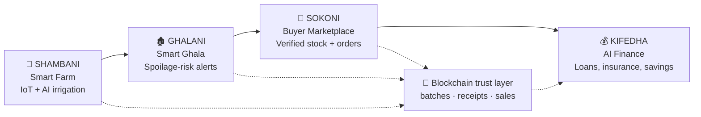
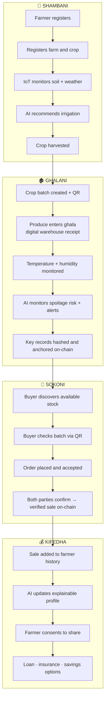
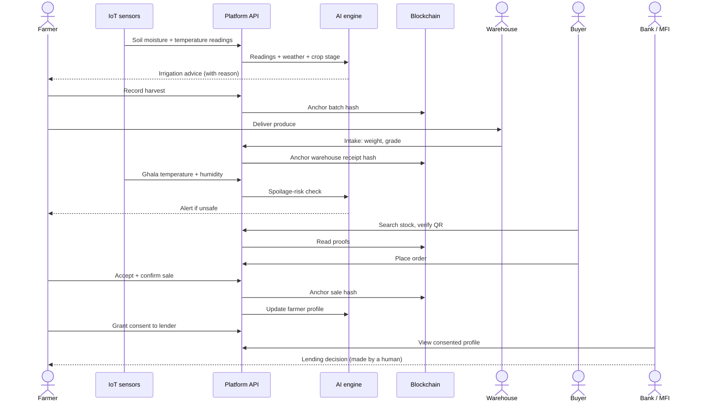
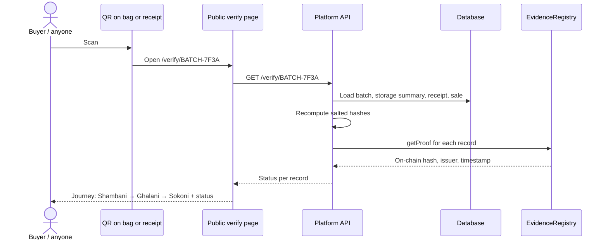
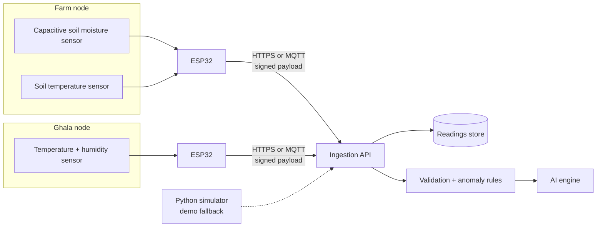
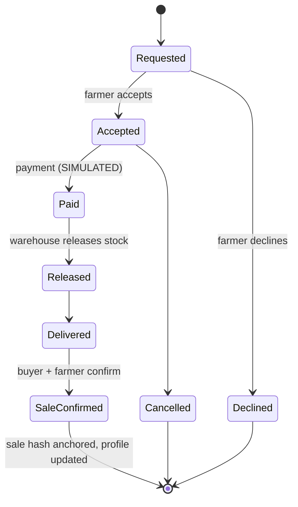
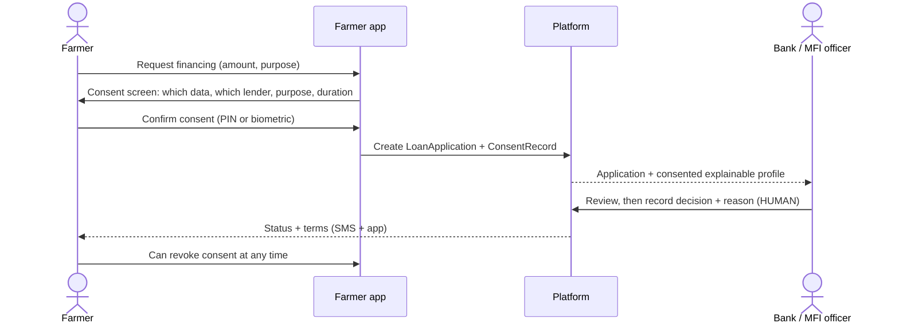
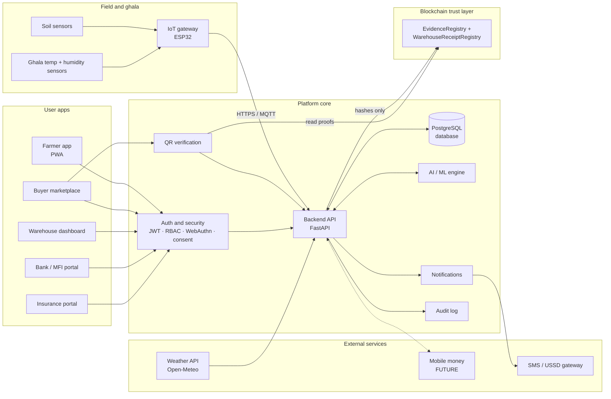
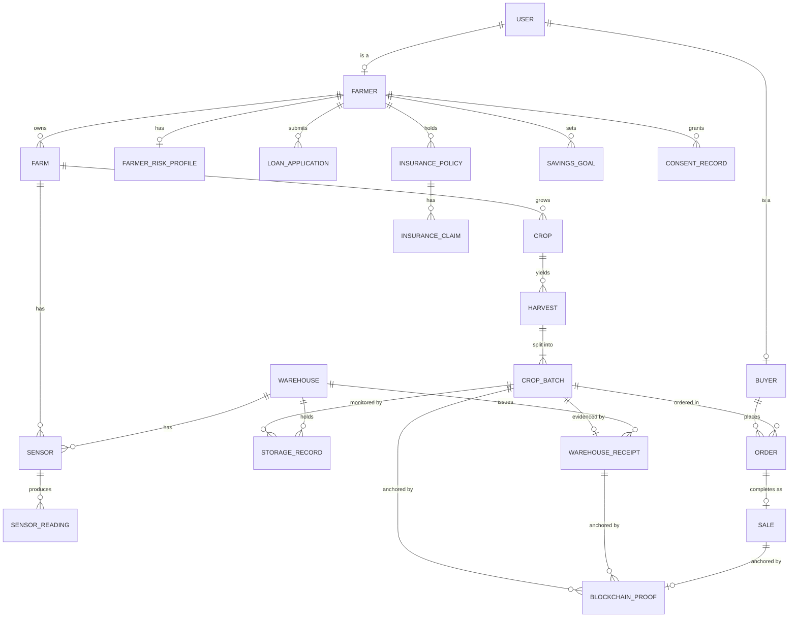

<div align="center">

# 🌱 Shambani → Kifedha

### Farm → Storage → Market → Finance

**An AI + IoT + blockchain network that turns a smallholder farmer's season into verifiable evidence, and turns that evidence into better harvests, safer storage, trusted buyers and access to finance.**

*Tanzania GirlCode Hackathon 2026 · Challenge #9: AI Agricultural Finance and Risk Network*

</div>

> **Working title.** To rename the project, search and replace the display name `Shambani → Kifedha` and the code slug `shamba-kifedha` across the repo.

---

## How to read this README

Every feature carries one of these labels, so judges, partners and developers can see what actually exists:

| Label | Meaning |
|---|---|
| `MVP` | Built and working in the hackathon demo |
| `SIMULATED` | Shown in the demo, but driven by simulated or synthetic data, or a mocked partner |
| `FUTURE` | Designed and documented, not built yet. Needs partners, real data, regulatory approval or more engineering |

**Quick links for each audience:**

- **Judges:** [Problem](#2-problem-statement) · [Solution](#4-proposed-solution) · [Hackathon MVP](#23-hackathon-mvp) · [Demo scenario](#24-demo-scenario) · [Expected impact](#30-expected-impact)
- **Developers:** [Architecture](#18-architecture-diagram) · [Data model](#20-suggested-data-model) · [Tech stack](#21-tech-stack) · [APIs](#22-apis-and-integrations) · [Setup](#25-installation-and-development-structure)
- **Banks, MFIs and insurers:** [AI layer](#8-ai-layer) · [Loans](#12-loans) · [Insurance](#13-insurance) · [Privacy & responsible AI](#17-privacy-and-responsible-ai)
- **Buyers and warehouses:** [Marketplace](#11-buyer--ghala-marketplace) · [Blockchain layer](#9-blockchain-trust-layer) · [Warehouse receipts](#63-digital-warehouse-receipts)
- **Farmers and cooperatives:** [User roles](#5-user-roles) · [Savings](#14-savings-and-financial-resilience) · [Low-connectivity design](#65-low-connectivity-design-tanzania-first)

---

## Table of contents

1. [Overview](#1-overview)
2. [Problem statement](#2-problem-statement)
3. [Why this matters](#3-why-this-matters)
4. [Proposed solution](#4-proposed-solution)
5. [User roles](#5-user-roles)
6. [Feature breakdown](#6-feature-breakdown)
7. [End-to-end system workflow](#7-end-to-end-system-workflow)
8. [AI layer](#8-ai-layer)
9. [Blockchain trust layer](#9-blockchain-trust-layer)
10. [IoT architecture](#10-iot-architecture)
11. [Buyer / Ghala marketplace](#11-buyer--ghala-marketplace)
12. [Loans](#12-loans)
13. [Insurance](#13-insurance)
14. [Savings and financial resilience](#14-savings-and-financial-resilience)
15. [Security](#15-security)
16. [Biometric security](#16-biometric-security)
17. [Privacy and responsible AI](#17-privacy-and-responsible-ai)
18. [Architecture diagram](#18-architecture-diagram)
19. [Data flow](#19-data-flow)
20. [Suggested data model](#20-suggested-data-model)
21. [Tech stack](#21-tech-stack)
22. [APIs and integrations](#22-apis-and-integrations)
23. [Hackathon MVP](#23-hackathon-mvp)
24. [Demo scenario](#24-demo-scenario)
25. [Installation and development structure](#25-installation-and-development-structure)
26. [Future roadmap](#26-future-roadmap)
27. [Business and sustainability model](#27-business-and-sustainability-model)
28. [African scalability](#28-african-scalability)
29. [Risks and limitations](#29-risks-and-limitations)
30. [Expected impact](#30-expected-impact)
31. [Team and contributors](#31-team-and-contributors)
32. [License](#32-license)

---

## 1. Overview

Shambani → Kifedha follows one smallholder farmer through the whole season and turns each stage into **evidence** that other people can trust:

| Stage | Kiswahili | What happens | Evidence created |
|---|---|---|---|
| 1 | **Shambani** (on the farm) | IoT sensors + weather data → AI irrigation advice and alerts | Farm activity and production history |
| 2 | **Ghalani** (in the warehouse) | Harvest becomes a crop batch; ghala temperature and humidity are monitored; AI flags spoilage risk | Storage-condition history, digital warehouse receipt |
| 3 | **Sokoni** (at the market) | Buyers discover verified stock, check the batch by QR, and order | Verified sales and buyer transactions |
| 4 | **Kifedha** (financial access) | With the farmer's consent, verified history becomes an explainable profile for loans, insurance and savings | A financial identity the farmer controls |

The platform connects **farmers, buyers, warehouse operators, banks/MFIs, insurers and cooperatives** on one shared, consent-based record.

**The mental model:**

| Layer | Role |
|---|---|
| **IoT** | *captures* evidence |
| **AI** | *understands* evidence |
| **Blockchain** | *verifies* important evidence (makes it tamper-evident) |
| **Marketplace** | *converts* produce into economic opportunity |
| **Finance** | *converts* verified history into financial inclusion |

---

## 2. Problem statement

> **How might we help smallholder farmers in Tanzania to increase productivity, reduce post-harvest losses, access reliable markets, and build a verifiable financial history despite limited access to real-time farm and storage information, trusted buyers, and formal financial records?**

| Challenge | What happens today | Consequence |
|---|---|---|
| **No real-time farm information** | Irrigation is based on habit or guesswork | Water and inputs are wasted, and yields suffer |
| **No real-time storage information** | Farmers can't see temperature or humidity inside the ghala | Spoilage is noticed only once the crop is already lost |
| **Untrusted, fragmented markets** | Buyers can't easily find or verify farmers' stock; middlemen dominate | Lower prices and unreliable sales |
| **No formal financial records** | Seasonal, informal income leaves no paper trail | Banks and insurers can't assess risk, so farmers are excluded |
| **Climate exposure** | Weather shocks hit farmers who have no protection | One bad season can wipe out savings |

The problems compound: a farmer with no records can't borrow for inputs, lower yields mean less to sell, and weak market access means no transaction history either.

---

## 3. Why this matters

- **Agriculture is central to Tanzania's economy and livelihoods,** and most farms are small-scale. Productivity gains for smallholders reach a very large number of households.
- **Post-harvest loss is a hidden tax.** Food that is grown, harvested and then lost in storage wastes every input that went into it.
- **Finance follows data.** Lenders and insurers price risk from records. A farmer with *verifiable* production, storage and sales history stops being a "no-file" applicant.
- **Trust is the missing infrastructure.** Farmers, warehouses, buyers and lenders don't fully trust each other's records. A shared, tamper-evident record reduces the cost of that trust.
- **Women farmers are often the most excluded** from formal finance and land records. Evidence-based profiles that don't depend on collateral like land titles can help close that gap. *(This fits the spirit of GirlCode.)*

> 📊 **Team to-do:** add 2–3 sourced statistics here (for example from NBS Tanzania, the Ministry of Agriculture, FAO or the World Bank). **Don't use numbers without a source.**

---

## 4. Proposed solution

One connected platform, four stages, one trust layer:



**Design principles**

1. **Evidence first.** Every stage produces data that later stages can rely on.
2. **The farmer owns and controls their data.** Sharing with a lender or insurer needs explicit, granular, revocable consent.
3. **Explainable, human-supervised AI.** No unexplained scores and no automated lending or claim decisions.
4. **Minimal on-chain footprint.** Only hashes, IDs and proofs go on-chain; raw and personal data never does.
5. **Built for Tanzania.** Kiswahili and English, mobile-first, low-bandwidth, offline-tolerant, with SMS/USSD and mobile-money paths.
6. **Honest about limits.** Simulated features are labelled, and the blockchain's guarantees are stated precisely (see [§9](#9-blockchain-trust-layer)).

---

## 5. User roles

| Role | Goals | Key actions | Can see | Cannot see |
|---|---|---|---|---|
| **Farmer** (*Mkulima*) | Better yields, less loss, fair buyers, access to finance | Register farm and crops, get advice, record harvests, list stock, accept orders, grant or revoke consent, request loans/insurance, set savings goals | Everything about their own farm, batches, sales, profile and consents | Other farmers' private data |
| **Buyer** (*Mnunuzi*) | Reliable, quality-verified supply | Search stock, view the digital ghala, verify batches by QR, order, message sellers | Public listing data, selected storage history, verification status | Farmer's personal, financial or risk data |
| **Warehouse operator** | Run a trusted ghala, issue receipts | Register intake, grade and weigh produce, issue digital warehouse receipts, monitor conditions, record releases | Batches in *their* warehouses, sensor data | Farmer's finances or unrelated farms |
| **Bank / MFI** | Lend to smallholders with manageable risk | View consented profiles, review applications, **make and record the lending decision** | Only the data the farmer consented to share, for the stated purpose and duration | Anything without consent |
| **Insurance provider** | Price and serve agricultural risk | View consented risk data, offer products, review and decide claims | Consented risk data, policy and claim records | Anything without consent |
| **Admin** | Operate the platform safely | Onboard partners, manage roles, monitor fraud alerts and audit logs | Operational and audit data; personal data only as needed, and access is logged | — |

### Role journeys (short)

**Farmer:** register (phone + PIN, optional biometrics) → add farm (location, acreage, crop, planting date) → receive irrigation advice → record harvest → deliver to ghala and receive a digital receipt → stock appears in the marketplace → accept a buyer's order → confirm the sale → view the explainable profile → share it with a lender (consent) → apply for a loan / get an insurance recommendation → plan savings.

**Buyer:** register and verify business → search by crop, grade, region and price → open a listing and view the digital ghala → scan or click the QR to verify the batch → place an order → message the seller → confirm delivery.

**Warehouse operator:** register the warehouse and its sensors → receive produce → record weight and grade → generate a digital warehouse receipt (anchored on-chain) → monitor conditions and act on alerts → record release when a sale completes.

**Bank / MFI:** receive a consented application → review the explainable profile (positive factors, risks, cash-flow estimate) → decide (**a human decision**) → record the decision and terms → track the repayment status.

**Insurer:** receive a consented risk summary → recommend or issue a policy → on a claim, review the evidence (weather data, storage records) → decide (**a human decision**) → record the outcome.

**Admin:** manage partner onboarding and roles → review fraud and suspicious-activity alerts → audit access to sensitive data.

---

## 6. Feature breakdown

### Feature status matrix

| # | Feature | Status | Details |
|---|---|---|---|
| 1 | Farm and crop registration | `MVP` | [§6.1](#61-farm--smart-irrigation) |
| 2 | IoT soil sensing | `MVP` real ESP32 sensor if available, otherwise `SIMULATED` | [§10](#10-iot-architecture) |
| 3 | Weather integration | `MVP` (Open-Meteo) | [§6.1](#61-farm--smart-irrigation) |
| 4 | AI irrigation recommendation | `MVP` (rule-based agronomic model) | [§8](#8-ai-layer) |
| 5 | Farm alerts and history | `MVP` | [§6.1](#61-farm--smart-irrigation) |
| 6 | Crop batches and ghala monitoring | `MVP` real or `SIMULATED` sensor | [§6.2](#62-smart-ghala--storage) |
| 7 | Spoilage-risk prediction and alerts | `MVP` (transparent rules); synthetic-data classifier is `FUTURE` | [§8](#8-ai-layer) |
| 8 | Digital warehouse receipts | `MVP` (platform receipt with QR, **not a legal instrument**); PDF export is `FUTURE` | [§6.3](#63-digital-warehouse-receipts) |
| 9 | Blockchain proofs + QR verification | `MVP` (EVM chain when configured; otherwise a local append-only ledger labelled `SIMULATED`) | [§9](#9-blockchain-trust-layer) |
| 10 | Buyer marketplace and digital ghala | `MVP` | [§11](#11-buyer--ghala-marketplace) |
| 11 | Orders and seller messaging | `MVP` orders; messaging is basic | [§11](#11-buyer--ghala-marketplace) |
| 12 | Payments / mobile money | `SIMULATED` | [§22](#22-apis-and-integrations) |
| 13 | Explainable farmer profile | `MVP` (transparent scorecard) | [§6.4](#64-ai-farmer-financial--risk-profile) |
| 14 | Consent management | `MVP` | [§17](#17-privacy-and-responsible-ai) |
| 15 | Loan request and lender portal | `SIMULATED` lender | [§12](#12-loans) |
| 16 | Insurance recommendation and claims | `SIMULATED` insurer | [§13](#13-insurance) |
| 17 | Parametric insurance demo | `SIMULATED` | [§13](#13-insurance) |
| 18 | Savings planner | `MVP` planner; account linking is `FUTURE` | [§14](#14-savings-and-financial-resilience) |
| 19 | Biometric login and confirmation | `MVP` (WebAuthn passkeys with the phone's fingerprint / face unlock; PIN + SMS OTP always available as fallback) | [§16](#16-biometric-security) |
| 20 | Kiswahili + English UI | `MVP` (switch on every screen; preference saved per user and used for SMS) | [§6.5](#65-low-connectivity-design-tanzania-first) |
| 21 | SMS alerts | `MVP` (sandbox) | [§22](#22-apis-and-integrations) |
| 22 | USSD access | `FUTURE` | [§6.5](#65-low-connectivity-design-tanzania-first) |
| 23 | Warehouse-receipt financing | `FUTURE` | [§6.3](#63-digital-warehouse-receipts) |
| 24 | Fraud / anomaly detection | `MVP` rules; ML is `FUTURE` | [§8](#8-ai-layer) |

### 6.1 Farm / Smart irrigation

| Capability | Status | Notes |
|---|---|---|
| Register farm, crop, acreage, planting date, location, soil type | `MVP` | Location from GPS or a map pin |
| IoT soil moisture + temperature (and other relevant conditions) | `MVP` / `SIMULATED` | ESP32 + capacitive soil-moisture sensor; the simulator covers demo gaps |
| Weather data (rain forecast, temperature, evapotranspiration) | `MVP` | Open-Meteo (free, no API key) |
| AI combines sensor + weather + crop stage | `MVP` | Rule-based water-balance model (see [§8](#8-ai-layer)) |
| Recommend **when** and **how much** to irrigate | `MVP` | Shown in Kiswahili and English, with a reason ("why") |
| Alerts for abnormal conditions (very dry soil, sensor offline, heat) | `MVP` | In-app + SMS (sandbox) |
| Historical farm activity | `MVP` | Readings, advice given, whether the farmer followed it, harvests |

### 6.2 Smart Ghala / Storage

| Capability | Status | Notes |
|---|---|---|
| Record harvested crop as a **batch** (crop, quantity, harvest date, farm) | `MVP` | Each batch gets a unique ID and a QR code |
| Monitor warehouse temperature + humidity | `MVP` / `SIMULATED` | DHT22 or SHT31 sensor on ESP32 |
| AI spoilage / storage-risk prediction | `MVP` | Low / Medium / High, with reasons |
| Alert the farmer and operator when conditions become unsafe | `MVP` | Includes a recommended action (for example, "ventilate today") |
| Show current quantity, crop, grade and storage status | `MVP` | Feeds the marketplace listing |
| Storage-condition history | `MVP` | Summaries are hashed and anchored on-chain ([§9](#9-blockchain-trust-layer)) |

### 6.3 Digital warehouse receipts

When produce enters a **verified** warehouse, the operator records:

| Field | Example |
|---|---|
| Receipt ID | `WR-2026-000123` |
| Crop / batch | Maize · `BATCH-7F3A` |
| Owner | Farmer ID (not the name, on-chain) |
| Warehouse | Warehouse ID + operator |
| Date in | 2026-09-12 |
| Quantity | Weighed at intake |
| Quality / grade | Grade assigned at intake |
| Storage info | Initial conditions, storage bay |

The platform then **generates the digital receipt** (with a PDF and QR) and **anchors its hash on-chain** (`MVP`). The receipt's status tracks its lifecycle: `ACTIVE → PARTIALLY_RELEASED → RELEASED`, or `PLEDGED` (future).

**Toward warehouse-receipt financing (`FUTURE`):** a trusted receipt can in principle serve as collateral: a farmer stores produce, pledges the receipt to a lender, borrows against it, and waits to sell until prices improve instead of selling at harvest-time lows. Tanzania already has a **regulated warehouse receipt system**, with a statutory regulator. **Our digital receipts are not legal warehouse receipts.** Using them for financing would require working with the relevant regulator, licensed warehouses and lenders, and aligning with the applicable law. We designed the data model (`WarehouseReceipt.status = PLEDGED`, `pledged_to`) so this integration is possible later.

### 6.4 AI farmer financial / risk profile

This is an **explainable profile, not a black-box credit score.** It is built only from data the farmer has consented to use:

| Input | Source stage |
|---|---|
| Production and harvest history | Shambani |
| Farm activity (for example, whether irrigation advice was followed) | Shambani |
| Storage management and losses | Ghalani |
| Sales history and buyer transactions | Sokoni |
| Climate / weather exposure for the farm location | Weather data |

The profile shows **positive factors, risk factors, a seasonal cash-flow estimate and the reasons behind every recommendation.** See the example in [§8](#8-ai-layer).

> ⚠️ **The platform never makes the final lending or insurance decision.** Banks, MFIs and insurers remain responsible for their decisions and must record them as human decisions.

### 6.5 Low-connectivity design (Tanzania-first)

| Need | Approach | Status |
|---|---|---|
| Language | **Kiswahili + English**, switchable; plain wording; icons alongside text | `MVP` |
| Mobile-first | Responsive **PWA**, installable, tested on low-end Android | `MVP` |
| Low bandwidth | Small bundles, compressed images, lazy loading, text-first views | `MVP` |
| Offline-first | Service-worker caching; queued actions sync when back online | `MVP` (basic) |
| No smartphone | **SMS alerts** now; **USSD** menus (check stock, advice, loan status) later | `MVP` SMS (sandbox) / `FUTURE` USSD |
| Payments | Mobile-money integration | `FUTURE` |
| Digital literacy | Simple flows, voice / illustrated hints, cooperative or extension-officer assisted mode | `FUTURE` (assisted mode) |

---

## 7. End-to-end system workflow



**Sequence view (one season):**



---

## 8. AI layer

### Rules vs. machine learning (honest labelling)

Many judges ask "is this really AI?" We separate three things clearly:

- **Business rules:** deterministic logic (thresholds, eligibility checks). Transparent and reliable. We use them where they are the right tool.
- **Agronomic / statistical models:** established formulas (for example, soil water balance and evapotranspiration) combined with sensor data.
- **Machine learning:** models learned from data. **In the MVP, any ML is trained on synthetic data and labelled as such.** Real-world accuracy requires real field data from pilots.

| AI component | Inputs | Hackathon MVP method | Production path | Output |
|---|---|---|---|---|
| **Irrigation recommendation** | Soil moisture, crop type and growth stage, rain forecast, ET₀ | Rules + agronomic model: compare moisture with a crop-specific refill threshold; skip if rain is forecast; volume from a simple water balance | Calibrate per soil/crop with pilot data; ML to learn farm-specific response | "Irrigate tomorrow morning, ~X mm" + reason |
| **Spoilage / storage-risk prediction** | Ghala temperature and humidity (trend + duration), crop type, days in storage | Rules from safe-storage ranges + a small classifier (for example, gradient boosting) **trained on synthetic data** | Retrain on real storage-outcome data from partner warehouses | Low / Medium / High risk + drivers + action |
| **Buyer matching** | Buyer needs (crop, grade, quantity, region, price), available batches | Filter + weighted ranking (rules) | Learning-to-rank from order history | Ranked listings |
| **Farmer risk profiling** | Consented production, storage, sales, activity, climate exposure | **Transparent weighted scorecard** with reason codes | Interpretable ML (for example, monotonic gradient boosting or logistic regression + SHAP), validated with partner lenders and audited for bias | Risk band + positive factors + risk factors |
| **Seasonal cash-flow estimate** | Expected yield × price history, sale timing, costs | Rule-based projection | Time-series forecasting with market price data | Month-by-month income estimate |
| **Financial product recommendation** | Profile + cash flow + product catalogue | Eligibility rules (for example, loan size vs. expected harvest income) | Contextual recommendation with lender feedback | Suggested products + why |
| **Anomaly / fraud detection** | Sensor streams, batches, orders, receipts | Rules: flat-lined or impossible sensor values, sudden jumps, duplicate batches, quantity mismatches (receipt vs. order vs. sale), unusual login or transaction patterns | Unsupervised models (for example, isolation forest) + analyst review | Alerts to admin / operator |

### Example: explainable profile output

```json
{
  "farmer_id": "FMR-0042",
  "generated_at": "2026-09-26T10:00:00Z",
  "model_version": "scorecard-v0.1 (hackathon)",
  "risk_band": "LOW",
  "positive_factors": [
    "Followed irrigation advice on 18 of 20 recommendations this season",
    "Ghala conditions stayed in the safe range; no spoilage alerts left unresolved",
    "3 verified sales to 2 different buyers"
  ],
  "risk_factors": [
    "Single crop (maize): exposed to drought in this district",
    "Only one season of verified history so far"
  ],
  "cash_flow_estimate": { "next_harvest_month": "2027-03", "expected_income_range_tzs": "[team to compute]" },
  "suggested_products": [
    { "type": "input_loan", "reason": "Repayment can be timed to the March harvest sale" },
    { "type": "weather_index_insurance", "reason": "Drought exposure is the main risk" }
  ],
  "disclaimer": "Decision support only. The lender makes and is accountable for the credit decision."
}
```

*(The values above are illustrative.)*

### Human oversight

- Every AI output that affects money (profile, loan insight, insurance risk) is **advisory**.
- Lenders and insurers must **record a human decision** and a reason; the platform stores who decided and when.
- Farmers can **see their own profile**, the factors behind it, and **contest** errors (for example, a sale that is missing).

---

## 9. Blockchain trust layer

### Why blockchain here, and not just a database?

The parties in this network (**farmers, warehouses, buyers, banks and insurers**) **do not fully trust each other**, and none of them should have to trust the platform operator blindly either.

With only a normal database, whoever controls it can **silently edit** a harvest quantity, a storage history or a sale. With key records anchored on a blockchain:

- Every party can **independently check** that a record hasn't been changed since it was anchored.
- Records carry a **timestamp and the identity of the issuer** (for example, which warehouse issued a receipt).
- **Warehouse receipts and ownership changes** get a shared, append-only history that every participant can audit.

### What blockchain does NOT do (important)

| ❌ It does not… | Why it matters |
|---|---|
| Prove that a sensor reading was **true** | Garbage in, garbage out. A faulty or tampered sensor produces a faithfully anchored *wrong* reading. We mitigate this with device authentication, anomaly detection and physical audits, not with blockchain. |
| Store private or raw data | Only hashes, IDs and minimal references go on-chain. |
| Replace legal registries or regulators | Our receipts are platform records, not legal warehouse receipts. |
| Automatically decide loans or claims | Humans at lenders and insurers decide. |

**In one line:** *blockchain makes recorded evidence **tamper-evident**; it does not make it true.*

### On-chain vs. off-chain

| Data | On-chain | Off-chain (PostgreSQL, encrypted where sensitive) |
|---|---|---|
| Crop batch ID + batch hash | ✅ | Full batch record |
| Harvest record | Hash only | Quantity, date, farm, photos |
| IoT / storage records | **Merkle root** of a reading window + summary hash | Every raw reading |
| Warehouse receipt | Receipt ID, hash, issuer, status changes | Full receipt, PDF |
| Verified sale | Sale ID + hash | Price, parties, delivery details |
| Ownership changes | Transfer events (pseudonymous IDs) | Identities |
| Insurance / finance references | Optional reference hash (for example, a policy ID) | Everything else |
| Personal info, biometrics, financial data | ❌ **Never** | Encrypted |

### How anchoring works

1. Build a **canonical JSON** of the record (sorted keys, fixed number formats).
2. Compute `hash = keccak256(canonical_json || salt)`. The **salt** is stored off-chain, so low-entropy data (for example, "500 kg maize") can't be brute-forced from the public hash.
3. For sensor data, group readings into windows (for example, per batch per day) and anchor the **Merkle root**, so one transaction covers many readings.
4. Call `EvidenceRegistry.anchor(recordType, recordId, hash)` from the platform's signing key (or, in production, the issuing party's key).
5. Store the transaction hash in `BlockchainProof` off-chain.

**Verifying:** recompute the hash from the database record plus its salt, read the on-chain hash, and compare. If they match, the record is unchanged since anchoring.

### Smart contracts (MVP)

```solidity
// contracts/src/EvidenceRegistry.sol (sketch)
interface IEvidenceRegistry {
    event Anchored(bytes32 indexed recordId, uint8 recordType, bytes32 dataHash, address issuer, uint64 timestamp);
    function anchor(bytes32 recordId, uint8 recordType, bytes32 dataHash) external;      // only authorised issuers
    function getProof(bytes32 recordId) external view returns (bytes32 dataHash, address issuer, uint64 timestamp);
}

// contracts/src/WarehouseReceiptRegistry.sol (sketch)
// One receipt per intake; status transitions are restricted to the issuing warehouse role.
// ACTIVE → PARTIALLY_RELEASED → RELEASED   (PLEDGED reserved for future financing)
```

- **Roles:** `ISSUER_PLATFORM`, `ISSUER_WAREHOUSE` (OpenZeppelin `AccessControl`).
- **Farmers do not need crypto wallets.** The platform or warehouse signs. Farmers interact through the app.
- **Network:** a local Anvil chain for development, and a **public EVM testnet** for the demo so judges can open the transactions in a block explorer. Production options (a permissioned or consortium chain, or a low-cost L2) will be chosen with partners based on cost, governance and data-residency needs.

### QR verification

Every batch and receipt has a QR code linking to `/verify/<id>`.



| Result | Meaning |
|---|---|
| ✅ **Verified** | The record matches its on-chain proof |
| ⚠️ **Mismatch** | The record has changed since anchoring. Treat it as suspicious |
| ⏳ **Not yet anchored** | The record exists but no proof has been written yet |

`FUTURE`: the verify page also queries the chain **directly** through a public RPC, so verification doesn't depend on trusting our API.

---

## 10. IoT architecture



| Component | MVP choice | Notes |
|---|---|---|
| Microcontroller | **ESP32** | Wi-Fi built in; cheap and widely available |
| Soil moisture | Capacitive sensor (for example, v1.2) | More durable than resistive probes; **needs calibration per soil** |
| Soil temperature | DS18B20 (optional) | Waterproof probe |
| Ghala temperature + humidity | DHT22 (cheap) or SHT31 (more accurate) | Place away from walls and doors |
| Connectivity | Wi-Fi → HTTPS (MVP) | `FUTURE`: GSM/LTE-M modules or LoRaWAN for remote farms |
| Power | USB (MVP) | `FUTURE`: solar + battery, deep sleep between readings |
| Resilience | **Store-and-forward:** buffer readings on-device when offline and upload later with the original timestamps | Essential for rural connectivity |
| Device identity | Per-device ID + secret; payload signed with HMAC | `FUTURE`: mTLS / secure element |
| Demo fallback | `iot/simulator` replays realistic curves (for example, rising ghala humidity) | Labelled `SIMULATED` in the UI |

**Example payload**

```json
{
  "device_id": "ESP32-GHALA-01",
  "ts": "2026-09-26T08:15:00Z",
  "readings": { "temperature_c": 27.4, "humidity_pct": 71.2 },
  "seq": 1842,
  "sig": "hmac-sha256:…"
}
```

The server rejects stale or replayed messages using `seq` and `ts`, and physically impossible values. Suspicious streams (flat-lining, sudden jumps) are flagged by the anomaly rules.

---

## 11. Buyer / Ghala marketplace

Buyers **inside or outside Tanzania** can discover farmers' available warehouse inventory.

| Listing field | Source | Status |
|---|---|---|
| Crop | Batch | `MVP` |
| Farmer / farm (display name, region; no personal contact details until an order is accepted) | Farmer profile | `MVP` |
| Quantity available | Warehouse receipt − releases | `MVP` |
| Quality / grade | Graded at warehouse intake | `MVP` |
| Location | Warehouse region (map) | `MVP` |
| Price | Set by the farmer or cooperative | `MVP` |
| Harvest date | Harvest record | `MVP` |
| Warehouse / storage status | Live risk level | `MVP` |
| Selected storage history | Chart of conditions over time | `MVP` |
| Verification status | On-chain proofs | `MVP` |
| QR verification | `/verify/<batch>` | `MVP` |

**Digital ghala view:** the buyer sees a visual of the farmer's stored stock (batches, quantities, grades, current conditions) as if walking through the warehouse.

**Order lifecycle**



- **Messaging:** basic in-app chat between buyer and seller per order (`MVP`).
- **Payments:** `SIMULATED` in the MVP. `FUTURE`: mobile money or bank transfer, with escrow-style release on delivery confirmation.
- **Cross-border buyers** (`FUTURE`): export documentation, phytosanitary certificates and currency handling are out of scope for the hackathon.

---

## 12. Loans



| Capability | Status |
|---|---|
| Loan request (amount, purpose, preferred repayment month) | `MVP` |
| Consent-gated sharing of verified history | `MVP` |
| Lender portal: profile, cash-flow estimate, suggested repayment timing | `SIMULATED` lender |
| Application status (`SUBMITTED → UNDER_REVIEW → APPROVED / DECLINED → DISBURSED → REPAYING → CLOSED`) | `MVP` status tracking |
| Suitable product suggestions (input loan, equipment, storage-backed) | `MVP` rules |
| Disbursement / repayment via mobile money | `FUTURE` |

**The AI provides risk insights and affordability / cash-flow information. It does not approve or decline.**

---

## 13. Insurance

| Capability | Status | Notes |
|---|---|---|
| Insurance recommendations | `MVP` rules | Based on crop, location and main risk (for example, drought or storage) |
| Farm / climate risk assessment | `MVP` | Historical weather for the location + farm data |
| Crop / storage risk information | `MVP` | From ghala monitoring |
| **Parametric insurance demo** | `SIMULATED` | Example: if cumulative rainfall from a trusted weather source falls below a threshold during a defined window, a claim is *proposed* |
| Claim workflow | `SIMULATED` insurer | `FILED → EVIDENCE_ATTACHED → UNDER_REVIEW → APPROVED / REJECTED → PAID` |
| Human / insurer oversight | Required | The insurer reviews and decides |

> A parametric trigger **proposes** a claim from trusted index data (in production, a vetted weather source or oracle). The **insurer remains responsible** for the policy terms, the decision and the payout. Neither AI nor blockchain decides claims automatically.

---

## 14. Savings and financial resilience

After a verified sale, the farmer gets a simple **savings planner** (`MVP`):

| Bucket | Purpose |
|---|---|
| 🌱 Next-season inputs | Seeds, fertiliser, irrigation costs |
| 🛟 Emergency reserve | Illness, crop failure, shocks |
| 🏠 Household / business needs | School fees, family costs, small investments |
| 🎯 Savings goals | For example, a water tank, a motorbike, storage bags |

- The AI suggests a split based on the seasonal cash-flow estimate (**rules in the MVP**). The farmer can always change it.
- Nudges arrive via SMS (for example, "Remember your input savings goal before planting").
- `FUTURE`: link to mobile-money savings wallets, bank accounts, or **VICOBA / SACCO** groups that farmers already use.

---

## 15. Security

Financial, insurance, location and identity data is **sensitive**. Security is designed in from the start, not bolted on.

### Threat model (summary)

| Threat | Example | Mitigation |
|---|---|---|
| Account takeover | SIM swap, stolen PIN | OTP + PIN + optional device biometrics; alerts on new-device login; step-up for sensitive actions |
| Data tampering | Editing a harvest quantity after the fact | On-chain hash anchoring + append-only audit log |
| Fake or faulty sensor data | Spoofed device, sensor moved | Device keys + signed payloads, anomaly rules, physical spot checks |
| Unauthorised data access | Lender browsing profiles without consent | Consent-gated APIs, RBAC, access logging |
| Fraudulent listings / orders | Selling stock that doesn't exist | Listings only from warehouse receipts; quantity reconciliation |
| Key compromise | Blockchain signing key leaked | Key kept in a secrets manager (MVP) or KMS/HSM (production); key rotation; issuer revocation on-chain |

### Security controls

| Area | Control | Status |
|---|---|---|
| **Authentication** | Phone + PIN / password (Argon2id hashing), OTP via SMS, optional WebAuthn passkeys (biometric) | `MVP` |
| **Sessions** | Short-lived JWT access tokens + rotating refresh tokens; device binding | `MVP` |
| **Authorization / RBAC** | Roles: `FARMER`, `BUYER`, `WAREHOUSE_OPERATOR`, `LENDER`, `INSURER`, `ADMIN`; checks on every endpoint + object-level ownership checks | `MVP` |
| **Encryption in transit** | TLS 1.2+ everywhere, including device → API | `MVP` |
| **Encryption at rest** | Encrypted database volume; field-level encryption for sensitive fields (national ID, financial data) | `MVP` for sensitive fields; full KMS is `FUTURE` |
| **Secure APIs** | Input validation (Pydantic), rate limiting, CORS allow-list, no secrets in the client, OWASP API Top 10 review | `MVP` |
| **Consent management** | Granular, purpose- and time-bound, revocable; enforced in the API layer | `MVP` |
| **Audit logs** | Append-only log of sensitive reads and writes (who, what, when, why); log digests periodically anchored on-chain | `MVP` log; anchoring is `FUTURE` |
| **Blockchain integrity verification** | Recompute and compare hashes; on-chain issuer allow-list | `MVP` |
| **IoT protection** | Per-device credentials, signed payloads, replay protection, firmware update plan | `MVP` (HMAC) / `FUTURE` (secure boot, OTA signing) |
| **Fraud detection** | Rule-based alerts (see [§8](#8-ai-layer)) | `MVP` |
| **Transaction confirmation** | PIN or biometric step-up for orders above a threshold, consent grants, payout-detail changes | `MVP` |
| **Privacy-by-design** | Data minimisation, pseudonymous IDs on-chain, salted hashes | `MVP` |
| **Minimal on-chain personal info** | None; only hashes and pseudonymous IDs | `MVP` |
| **Recovery** | Account recovery via verified phone + OTP + assisted recovery through a cooperative or admin with identity checks; lost-device revocation of passkeys | `MVP` basic |
| **Suspicious activity alerts** | New device, unusual location, repeated failed PINs, large order changes → SMS / in-app alert + temporary lock | `MVP` basic |

### RBAC permission matrix (MVP)

| Resource | Farmer | Buyer | Warehouse | Lender | Insurer | Admin |
|---|---|---|---|---|---|---|
| Own farm, sensors, advice | RW | — | — | — | — | R (logged) |
| Batches / receipts | R (own) | R (listed) | RW (own warehouse) | R (consented) | R (consented) | R |
| Listings | RW (own) | R | R | — | — | R |
| Orders | RW (own) | RW (own) | R (own warehouse) | — | — | R |
| Farmer risk profile | R (own) | — | — | R (consented) | R (consented) | — |
| Loan applications | RW (own) | — | — | RW (assigned) | — | R |
| Insurance policies / claims | RW (own) | — | — | — | RW (own products) | R |
| Consent records | RW (own) | — | — | R (own grants) | R (own grants) | R |
| Audit logs | R (own access history) | — | — | — | — | R |

---

## 16. Biometric security

Biometrics are **optional**, **consent-based** and **verified locally on the user's device.**

| Principle | Implementation |
|---|---|
| **No raw biometric data stored by us** | We use **WebAuthn / passkeys** (web) and platform APIs (Android `BiometricPrompt`, iOS `LocalAuthentication`) in the native app later. The fingerprint or face is checked **on the device**; our server stores only a **public key credential**. |
| **Never on blockchain** | Biometric data (or anything derived from it) is **never** written on-chain. |
| **Login** | Passkey sign-in where the device supports it |
| **Transaction confirmation** | Biometric or PIN step-up for high-value orders, loan consent, payout-detail changes, account changes |
| **Fallback** | PIN / password / SMS OTP for devices without biometric hardware, or for users who prefer not to use biometrics |
| **Shared phones** | Common in rural areas. Device biometrics prove *someone enrolled on this device*, not necessarily the account holder, so sensitive actions **also require the user's PIN** on shared devices |
| **Consent + accessibility** | Clear opt-in explanation in Kiswahili and English; never mandatory; the alternative flows are equally usable (for example, for users with worn fingerprints or visual impairments) |
| **Revocation** | Users can remove a passkey or device at any time; lost devices can be revoked via recovery |

---

## 17. Privacy and responsible AI

### Privacy

- **Consent model:** each `ConsentRecord` states *who* (a specific lender or insurer), *what* (data categories), *why* (purpose), and *until when* (expiry). It is revocable at any time and every use is logged.
- **Data minimisation:** collect only what a feature needs; buyers never see financial or risk data.
- **Pseudonymous on-chain IDs + salted hashes:** public proofs reveal nothing about the farmer.
- **Right to access, export and delete:** off-chain data can be exported or deleted. On-chain hashes remain, but without the off-chain data and salt they reveal nothing.
- **Regulatory alignment:** production deployment must comply with Tanzania's **Personal Data Protection Act (2022)** and its regulator's requirements, as well as the rules of each partner institution (financial and insurance regulators). *Legal review is required before launch.*

### Responsible AI

| Commitment | How |
|---|---|
| **Explainable** | Every profile and recommendation lists its factors and reasons |
| **Human-in-the-loop** | No automated approval or denial of loans or claims |
| **Fair** | No gender, ethnicity, religion or other protected attributes as model inputs; outcomes monitored by group (including **women farmers**) for disparate impact |
| **Contestable** | Farmers can flag wrong data or outcomes; flagged records trigger review |
| **Transparent about data** | Synthetic-data models are labelled; model versions are recorded with every output |
| **Documented** | A model card per AI component (purpose, data, limits, evaluation) — `FUTURE` for production |

---

## 18. Architecture diagram



---

## 19. Data flow

| Data | Created by | Stored | Visible to | On-chain | Sensitivity |
|---|---|---|---|---|---|
| Account + identity | Farmer / users | DB (encrypted fields) | Owner, admin (logged) | ❌ | 🔴 High |
| Farm location + details | Farmer | DB | Owner, warehouse (region only), consented partners | ❌ | 🟠 Medium |
| Raw sensor readings | IoT devices | DB | Owner, warehouse (ghala sensors) | Merkle root only | 🟢 Low–Medium |
| Irrigation advice + adherence | AI engine | DB | Owner, consented partners | ❌ | 🟠 Medium |
| Harvest + batch | Farmer | DB | Owner, warehouse, buyers (listing fields) | Hash | 🟢 Low |
| Storage records | IoT + AI | DB | Owner, warehouse, buyers (summary) | Hash / Merkle root | 🟢 Low |
| Warehouse receipt | Warehouse operator | DB + PDF | Owner, warehouse, consented lender | ID + hash + status | 🟠 Medium |
| Orders + sales | Buyer + farmer | DB | The parties involved | Sale hash | 🟠 Medium |
| Risk profile | AI engine | DB | Owner, consented lender / insurer | ❌ | 🔴 High |
| Loan / insurance records | Partners + farmer | DB (encrypted) | Owner, the specific partner | Optional reference hash | 🔴 High |
| Biometric data | Device only | **Never leaves the device** | — | ❌ | 🔴 High |
| Consent records | Farmer | DB | Owner, the named partner, admin | Optional hash | 🟠 Medium |

---

## 20. Suggested data model



| Entity | Key fields (high level) |
|---|---|
| **User** | `id`, `phone`, `email?`, `role`, `pin_hash`, `language`, `status`, `created_at` |
| **Farmer** | `id`, `user_id`, `display_name`, `region`, `district`, `cooperative_id?`, `kyc_level` |
| **Farm** | `id`, `farmer_id`, `name`, `geo_point`, `acreage`, `soil_type`, `irrigation_type` |
| **Crop** | `id`, `farm_id`, `crop_type`, `variety?`, `planting_date`, `expected_harvest_date`, `growth_stage` |
| **Sensor** | `id`, `device_id`, `type` (soil / ghala), `farm_id?`, `warehouse_id?`, `secret_hash`, `calibration`, `last_seen_at` |
| **SensorReading** | `id`, `sensor_id`, `ts`, `metric`, `value`, `seq`, `quality_flag` |
| **Harvest** | `id`, `crop_id`, `harvest_date`, `quantity_kg`, `notes` |
| **CropBatch** | `id` (public, e.g. `BATCH-7F3A`), `harvest_id`, `crop_type`, `quantity_kg`, `grade?`, `status`, `qr_url`, `salt` |
| **Warehouse** | `id`, `name`, `operator_user_id`, `geo_point`, `capacity`, `verified` |
| **StorageRecord** | `id`, `batch_id`, `warehouse_id`, `window_start`, `window_end`, `temp_avg/max`, `rh_avg/max`, `risk_level`, `merkle_root` |
| **WarehouseReceipt** | `id`, `batch_id`, `warehouse_id`, `owner_farmer_id`, `quantity_kg`, `grade`, `date_in`, `status`, `pledged_to?` |
| **Buyer** | `id`, `user_id`, `business_name`, `country`, `verified` |
| **Order** | `id`, `buyer_id`, `batch_id`, `quantity_kg`, `price_per_kg`, `currency`, `status` |
| **Sale** | `id`, `order_id`, `confirmed_by_farmer_at`, `confirmed_by_buyer_at`, `amount`, `payment_ref?` |
| **BlockchainProof** | `id`, `entity_type`, `entity_id`, `data_hash`, `chain_id`, `tx_hash`, `block_number`, `anchored_at` |
| **FarmerRiskProfile** | `id`, `farmer_id`, `model_version`, `risk_band`, `positive_factors[]`, `risk_factors[]`, `cash_flow_json`, `generated_at` |
| **LoanApplication** | `id`, `farmer_id`, `lender_id`, `amount`, `purpose`, `status`, `decision_by`, `decision_reason`, `consent_id` |
| **InsurancePolicy** / **InsuranceClaim** | policy: `id`, `farmer_id`, `insurer_id`, `product`, `coverage`, `status` · claim: `id`, `policy_id`, `trigger_type`, `evidence_refs`, `status`, `decided_by` |
| **SavingsGoal** | `id`, `farmer_id`, `bucket`, `target_amount`, `saved_amount`, `due_date` |
| **ConsentRecord** | `id`, `farmer_id`, `grantee_id`, `data_categories[]`, `purpose`, `granted_at`, `expires_at`, `revoked_at?` |

---

## 21. Tech stack

Chosen for **a 24–48 hour build**: few moving parts, one main backend language shared with the ML code, and tools the team already knows well.

| Layer | MVP choice | Why | Production path |
|---|---|---|---|
| **Frontend** | React + Vite + TypeScript, Tailwind CSS, `vite-plugin-pwa`, `react-i18next` (sw/en), Recharts (Leaflet + OpenStreetMap maps are `FUTURE`) | Fast to build; one PWA with role-based views | Native Android app (Kotlin or React Native) for field use |
| **Backend** | Python **FastAPI** + Pydantic, SQLAlchemy / SQLModel, Alembic | Same language as the ML code; automatic OpenAPI docs | Split into services only when needed |
| **Database** | **PostgreSQL** (Docker) | Relational data + JSONB; one database for everything | TimescaleDB for sensor time series; read replicas |
| **IoT** | ESP32 (Arduino / PlatformIO), capacitive soil sensor, DHT22 / SHT31, HTTPS POST; Python simulator | Cheap, well documented, quick to wire | MQTT broker (Mosquitto / EMQX), LoRaWAN or GSM, OTA updates |
| **AI / ML** | pandas, scikit-learn; rules engine in plain Python | Enough for rules + a small classifier | MLflow model registry, SHAP explanations, scheduled retraining |
| **Blockchain** | **Solidity + Foundry** (forge / anvil), OpenZeppelin `AccessControl`, `web3.py` from the backend; local Anvil + a public EVM testnet | The team is strong at low level; Foundry is fast and testable | Permissioned or consortium chain or a low-cost L2, chosen with partners; KMS-backed signing |
| **Auth / biometrics** | JWT (access + refresh), Argon2id, **WebAuthn** via `py_webauthn` + `@simplewebauthn/browser`, SMS OTP | Passkeys give device biometrics without us storing biometric data | Native biometrics in the mobile app; risk-based auth |
| **Weather** | **Open-Meteo** (forecast, precipitation, ET₀) | Free, no API key | Add a national met-service feed where partnerships allow |
| **QR** | `qrcode` (Python) to generate; `html5-qrcode` to scan in the browser | Simple, works offline | Printed tamper-evident QR labels for bags |
| **Notifications** | In-app + SMS via **Africa's Talking** sandbox | Common in East Africa; also offers USSD | USSD menus, WhatsApp Business |
| **Deployment** | Docker Compose; frontend on Vercel / Netlify; API on Render / Railway / Fly.io or a small VPS | Deploys in minutes | Kubernetes or managed containers; in-country hosting if data residency requires it |

**Deliberately avoided for the MVP:** microservices, Kubernetes, a message queue, crypto wallets for farmers, custom tokens.

---

## 22. APIs and integrations

### Internal REST API (MVP)

| Method | Endpoint | Role | Purpose |
|---|---|---|---|
| POST | `/auth/register`, `/auth/login`, `/auth/otp/verify` | Public | Sign-up and login |
| POST | `/auth/webauthn/register/{begin,finish}` | User | Add a passkey (biometric) |
| POST | `/auth/webauthn/authenticate/{begin,finish}` | User | Login or step-up confirmation |
| POST / GET | `/farms`, `/farms/{id}` | Farmer | Register and view a farm |
| POST | `/iot/readings` | Device (HMAC) | Ingest sensor data |
| GET | `/farms/{id}/irrigation-advice` | Farmer | Current recommendation + reason |
| POST | `/harvests`, `/batches` | Farmer | Record harvest, create batch + QR |
| POST | `/warehouses/{id}/intake` | Warehouse | Intake → StorageRecord + WarehouseReceipt |
| GET | `/batches/{id}/storage-risk` | Farmer, Warehouse | Risk level + drivers |
| GET | `/marketplace/listings?crop=&grade=&region=&max_price=` | Buyer | Search stock |
| POST / PATCH | `/orders`, `/orders/{id}` | Buyer, Farmer | Place, accept, update orders |
| POST | `/sales/{id}/confirm` | Buyer, Farmer | Two-party sale confirmation → anchor |
| GET | `/verify/{id}` | Public | QR verification result |
| GET | `/farmers/{id}/profile` | Farmer; Lender / Insurer with consent | Explainable profile |
| POST / DELETE | `/consents`, `/consents/{id}` | Farmer | Grant and revoke consent |
| POST / PATCH | `/loans`, `/loans/{id}/decision` | Farmer / Lender | Apply; lender records a human decision |
| GET / POST | `/insurance/recommendations`, `/insurance/claims` | Farmer / Insurer | Recommendations and claims |
| GET / POST | `/savings/plan`, `/savings/goals` | Farmer | Savings planner |
| GET | `/admin/audit`, `/admin/alerts` | Admin | Audit log and fraud alerts |

### External integrations

| Integration | Purpose | MVP status |
|---|---|---|
| Open-Meteo | Forecasts, rainfall, ET₀, historical weather | `MVP` |
| Africa's Talking | SMS alerts + OTP; USSD later | `MVP` sandbox / `FUTURE` USSD |
| EVM RPC (local Anvil / public testnet) | Anchor and read proofs | `MVP` |
| Mobile-money providers or aggregators | Payments, disbursements, savings | `FUTURE` (`SIMULATED` in the demo) |
| Bank / MFI core systems | Loan applications and status | `FUTURE` (lender portal is `SIMULATED`) |
| Insurer systems + weather oracle | Policies, parametric triggers | `FUTURE` (`SIMULATED`) |
| Warehouse-receipt regulator / registry | Legal receipt integration | `FUTURE` |

---

## 23. Hackathon MVP

**Goal:** demonstrate **one farmer's journey, end to end**, and do it convincingly. This is not the whole platform.

```mermaid
flowchart LR
    A["Sensor or simulated<br/>IoT data"] --> B["AI irrigation<br/>recommendation"]
    B --> C["Harvest"]
    C --> D["Crop batch + QR"]
    D --> E["Ghala temp + humidity<br/>monitoring"]
    E --> F["Spoilage alert"]
    F --> G["Blockchain proof"]
    G --> H["QR verification"]
    H --> I["Buyer sees ghala stock"]
    I --> J["Buyer places<br/>simulated order"]
    J --> K["Sale recorded"]
    K --> L["Farmer profile updated"]
    L --> M["Simulated loan + insurance<br/>recommendation"]
```



### In scope vs. out of scope

| ✅ In scope | ❌ Out of scope (explicitly) |
|---|---|
| 1 farmer, 1 farm, 1 crop (maize), 1 warehouse, 1 buyer, 1 simulated lender + insurer | Multiple regions, real partners |
| Real ESP32 sensor **if hardware works**; simulator otherwise | Field-grade hardware, power, enclosures |
| Rule-based irrigation + spoilage logic; one small synthetic-data classifier | Models trained on real data |
| Two contracts on a local chain / testnet | Mainnet, token economics |
| Explainable scorecard profile | Real credit scoring |
| PWA in Kiswahili + English, with passkey login | USSD, native apps |
| Simulated payment | Real money movement |

### Build plan (48 h, four workstreams; compress proportionally for 24 h)

| Hours | Frontend (A) | Backend + DB (B) | IoT + AI (C) | Blockchain + security (D) |
|---|---|---|---|---|
| 0–4 | Wireframes, i18n setup | Schema, auth skeleton | Wire ESP32, start simulator | Contract interfaces, Foundry setup |
| 4–16 | Farmer screens | Farm, IoT ingest, batch APIs | Irrigation rules + Open-Meteo | `EvidenceRegistry` + tests, anchoring service |
| 16–28 | Ghala + marketplace screens | Intake, receipts, orders | Spoilage rules + classifier | `WarehouseReceiptRegistry`, `/verify` |
| 28–40 | Profile, consent, loan / insurance screens | Profile, consent, loans | Scorecard + cash flow | WebAuthn, RBAC checks, audit log |
| 40–48 | Polish, offline caching | Seed demo data | Demo scenario data | Testnet deploy, **dry-run the demo ×3** |

**For a 24 h hackathon, cut in this order:** savings planner → insurance claim flow → messaging → WebAuthn (keep PIN) → ML classifier (keep rules).

### Definition of done

- [ ] The full demo path runs on one laptop **with no internet except the testnet RPC** (a local Anvil fallback is ready)
- [ ] Every simulated component is labelled `SIMULATED` in the UI
- [ ] The QR scan shows ✅ Verified; editing a DB value shows ⚠️ Mismatch (the tamper demo)
- [ ] The UI works in both Kiswahili and English
- [ ] The profile shows its factors and the "lender decides" disclaimer

---

## 24. Demo scenario

**Persona (fictional):** *Mama Neema, a maize farmer in Dodoma region, member of a local cooperative.*

| Time | Screen | What happens | What we say |
|---|---|---|---|
| 0:00 | Farmer app (Kiswahili) | Neema logs in with a passkey (fingerprint) | "Secure, simple, in her language." |
| 0:15 | Farm dashboard | The soil moisture reading drops (live sensor or simulator) | "The sensor sees the soil drying out." |
| 0:30 | Advice card | *"Mwagilia kesho asubuhi"* (irrigate tomorrow morning) + reason: no rain forecast | "The AI combines sensor, weather and crop stage." |
| 0:50 | Harvest | Records the harvest → batch `BATCH-7F3A` + QR | "Her harvest becomes a traceable batch." |
| 1:05 | Warehouse dashboard | Intake 2.5 t, Grade A → digital receipt | "The ghala issues a digital receipt, and its proof goes on-chain." |
| 1:20 | Ghala monitor | Humidity climbs → **HIGH risk** alert + SMS | "We catch spoilage before it starts." |
| 1:40 | Buyer marketplace | The buyer finds the batch and sees the storage history | "Buyers see real, verified stock." |
| 1:55 | QR scan | ✅ Verified; then we tamper with the DB → ⚠️ Mismatch | "Blockchain makes the record tamper-evident." |
| 2:15 | Order | Order → accept → simulated payment → sale confirmed | "The verified sale joins her history." |
| 2:30 | Kifedha | Explainable profile + consent → simulated lender sees it | "The bank sees *why*, and still decides for itself." |
| 2:50 | Close | Loan + insurance + savings suggestions | "Grow smarter. Store safer. Sell better. Become financially visible." |

*(The numbers in the demo are sample data.)*

---

## 25. Installation and development structure

```text
shamba-kifedha/
├── apps/
│   └── web/                     # React + Vite + TypeScript PWA (all roles)
│       ├── src/
│       │   ├── i18n/            # sw.json, en.json (+ index.ts: detector, default Kiswahili)
│       │   ├── app/nav.ts       # role-based navigation (mirrors the routes in App.tsx)
│       │   ├── features/        # farmer, ghala, marketplace, orders, finance, verify, account, admin, auth
│       │   ├── components/      # ui.tsx (design system), Layout, ConfirmAction, charts, crops, alerts
│       │   └── lib/             # api client (token refresh), auth context, hooks
│       └── scripts/check-i18n.mjs   # fails the build if sw/en keys or placeholders differ
├── services/
│   └── api/                     # FastAPI backend
│       ├── app/
│       │   ├── routers/         # auth, farms, iot, batches (+warehouses, receipts, QR), market (+orders, sales), verify, finance, admin, demo
│       │   ├── models.py        # SQLModel entities (see §20)
│       │   ├── ai/              # irrigation.py, spoilage.py, profile.py (scorecard + cash flow), anomalies.py
│       │   ├── chain/           # hashing.py (canonical JSON, salt, Merkle), anchor.py (web3 or simulated ledger), records.py
│       │   ├── security/        # auth.py (Argon2id, JWT, RBAC, PIN step-up), consent.py, audit.py
│       │   ├── integrations/    # open_meteo.py, sms.py (Africa's Talking), payments_mock.py
│       │   ├── i18n.py          # every generated text in Kiswahili + English
│       │   └── seed.py          # demo scenario (§24)
│       └── tests/               # end-to-end journey + unit tests
├── contracts/                   # Foundry: EvidenceRegistry.sol, WarehouseReceiptRegistry.sol, tests, Deploy.s.sol
├── iot/
│   ├── firmware/ghala-node/     # ESP32 + DHT22 (PlatformIO), HMAC-signed, store-and-forward
│   └── simulator/simulate.py    # signed SIMULATED readings (standard library only)
├── docker-compose.yml
├── .env.example
└── README.md
```

### Prerequisites

Python 3.11+ · Node.js 20+ · (optional) Docker, Foundry (`forge`, `anvil`), PlatformIO

### Quick start (local, no internet needed)

```bash
cp .env.example .env

# 1. API (SQLite by default) + demo data
cd services/api
pip install -r requirements.txt
python -m app.seed                       # resets the DB and loads the Mama Neema scenario
uvicorn app.main:app --reload            # http://127.0.0.1:8000/docs

# 2. Web app (proxies /api to the API)
cd apps/web && npm install && npm run dev   # http://localhost:5173

# 3. Optional: signed sensor data (if no hardware)
python iot/simulator/simulate.py --scenario demo

# Tests
cd services/api && pytest
cd apps/web && npm run check:i18n && npm run build
```

Or everything with Docker (PostgreSQL): `docker compose up --build`, then `docker compose exec api python -m app.seed` and open http://localhost:8080.

**Demo accounts** (PIN `1234`): farmer `+255700000001` (Kiswahili), buyer `+255700000002` (English), warehouse `+255700000003`, lender `+255700000004`, insurer `+255700000005`, admin `+255700000009`. The login page lists them.

### Languages: Kiswahili and English

- A **Kiswahili | English** switch sits in the header of every screen, including login, registration and the public QR verify page. Kiswahili is the default.
- The choice is saved in the browser and, for signed-in users, on their account (`PATCH /me {"language": "sw" | "en"}`). On login the app opens in the account's saved language, so on a shared phone each person sees their own language.
- Everything the platform generates (irrigation advice and its reasons, spoilage drivers and actions, alerts, profile factors, savings and insurance texts) comes from the API as `{"en": "…", "sw": "…"}`, so switching is instant and needs no reload.
- SMS alerts and OTP codes are sent in the recipient's saved language.
- `npm run check:i18n` (also part of `npm run build`) fails if the two translation files differ in keys or `{{placeholders}}`, or if the code uses a missing key. A backend test checks the same for `app/i18n.py`.

### Demo helpers (`DEV_MODE=true` only)

| Action | Where |
|---|---|
| Soil drying / rain coming / after rain | Farmer home → Demo controls → `POST /demo/scenario/soil-drying`, `soil-wet`, `/demo/weather/{rain,dry,live}` |
| Ghala humidity rising / ventilate | Warehouse overview → Demo controls → `ghala-humid`, `ghala-normal` |
| Tamper demo (✅ → ⚠️ → ✅) | Admin → Demo tools → `POST /demo/tamper/{batch}` and `/demo/restore/{batch}` |
| Sandbox OTP | Shown on screen after registration |

### Design system

The web app uses one small design system (`apps/web/src/components/ui.tsx` + tokens in `src/index.css`), taken from the pitch deck:

| Token | Use |
|---|---|
| Forest green `#1f5134` | Primary actions, "good" states |
| Harvest gold `#e2a72e` | Next step, highlights, harvest month |
| Terracotta `#a9542a` | Temperature, secondary emphasis |
| Paper `#f7f2e6` / surface `#fffdf7` | Backgrounds |
| Amber / red | Only for real risk (MEDIUM / HIGH), always with an icon and a word |

Inter (self-hosted) and Lucide icons. Risk is never shown by colour alone. Recommendations always show *why* ("Why this recommendation"). Money-affecting AI output is labelled as decision support, and lenders and insurers record human decisions with a reason. Every simulated component is labelled.

Navigation per role lives in `src/app/nav.ts`: farmers get Home, My farm, Ghala, Market, Finance (with alerts in the top bar); buyers get Marketplace, My orders, Verify batches, Suppliers, Payments; warehouses get Overview, Stock, Intake, Releases, Alerts; banks get Overview, Farmers, Applications, Risk profiles, Loan book; insurers get Overview, Policies, Farm risk, Claims.

Crop photos in `apps/web/public/images` are from Wikimedia Commons: maize kernels (Danielgrad, CC BY-SA 3.0), rice (JoabJacob, CC BY-SA 4.0), sorghum (Salil Kumar Mukherjee, CC BY-SA 4.0), kidney beans (David E Mead, CC0), sunflower seeds (Kaldari, public domain), maize farm in Tanzania (Evancez, CC BY-SA 4.0).

### Using a real chain

Deploy the contracts (see `contracts/README.md`), then set `RPC_URL`, `CHAIN_ID`, `ANCHOR_SIGNER_KEY` and `EVIDENCE_REGISTRY_ADDRESS`. New proofs are then written to the chain (`mode: ONCHAIN`) and the verify page reads them back from it. Without these settings a hash-chained local ledger is used and labelled `SIMULATED` in the UI.

### What is built vs. still open

| Area | State |
|---|---|
| End-to-end demo path (§23) | Built and covered by `tests/test_journey.py` |
| Irrigation, spoilage, profile, fraud rules | Built (rules). ML classifier and SHAP explanations are `FUTURE` |
| WebAuthn / passkeys | Built: enrol in Profile & security, sign in, and confirm sensitive actions (a 5-minute step-up token replaces the PIN). Only public keys are stored. Challenges are kept in memory, so run one API worker or move them to Redis |
| Soil test (pH, N, P, K) | Optional on each farm; used in the planting advice. Values come from a lab, the TARI soil map or the farmer |
| Receipt PDF, map view (Leaflet) | Not built; receipts have QR + verify page, farms use GPS coordinates |
| Offline | App shell and recent GET responses cached by the service worker; queued writes are `FUTURE` |
| Database migrations | Tables are created on start-up; Alembic migrations are `FUTURE` |

---

## 26. Future roadmap

| Phase | Focus | Milestones |
|---|---|---|
| **0 — Hackathon** | Prove the journey | End-to-end demo, open-source repo, pitch |
| **1 — Pilot** | One cooperative, one warehouse, one MFI, one insurer | Field-grade sensors, real calibration, real storage outcomes, legal / privacy review, USSD + mobile money |
| **2 — Evidence at scale** | Several districts and crops | ML trained on real data, lender-validated profiles, warehouse-receipt integration with the regulated system, native Android app |
| **3 — Regional** | East Africa, then beyond | Multi-country, multi-currency, local languages, partner-run nodes on a consortium chain |

---

## 27. Business and sustainability model

**Core features stay free for farmers.** Revenue comes from the parties who gain the most from verified data and trusted trade:

| Revenue stream | Who pays | Notes |
|---|---|---|
| Marketplace transaction fee | Buyer (and / or seller) | Small percentage on confirmed sales |
| Warehouse SaaS | Warehouse operators / cooperatives | Monitoring dashboard, digital receipts, alerts |
| Data-access / API fees (consent-based) | Banks, MFIs, insurers | Per consented profile or per application; the farmer's consent is always required |
| Sensor-kit leasing | Cooperatives, NGOs, projects | Shared kits per group or warehouse |
| Partnerships and grants | Development partners, government programmes | Especially for early pilots |
| Premium analytics | Agribusinesses, processors | Aggregated and **anonymised** supply insights only |

---

## 28. African scalability

| Dimension | How we scale |
|---|---|
| **Language** | i18n from day one: Kiswahili + English, then others (for example, French, Amharic, Hausa) |
| **Currency + payments** | Multi-currency fields; a pluggable payments adapter per country's mobile-money providers |
| **Regulation** | Country-specific consent, data-protection and warehouse-receipt modules; local legal review per market |
| **Crops + climate** | Crop profiles (thresholds, growth stages) as configuration, not code |
| **Infrastructure** | Offline-first PWA, SMS / USSD, low-power IoT; data residency options |
| **Trust network** | A consortium chain where partner institutions in each country can run their own nodes |
| **Existing systems** | Several African countries already run warehouse-receipt systems and commodity exchanges. We integrate with them rather than replace them |

---

## 29. Risks and limitations

| Risk / limitation | Impact | Mitigation |
|---|---|---|
| **Sensor data can be wrong or tampered with** | Blockchain faithfully records bad data | Device authentication, anomaly rules, calibration, physical audits; we state this limit openly |
| Synthetic training data | Model accuracy is unproven | Clearly labelled; retrain with pilot data before any real use |
| Connectivity gaps | Missing readings, delayed alerts | Store-and-forward on devices; offline-first app; SMS |
| Hardware cost and maintenance | Adoption barrier | Shared kits per cooperative or warehouse; leasing model |
| Digital literacy | Low usage | Kiswahili-first simple UX, assisted mode through cooperatives and extension officers |
| Regulatory (data, finance, insurance, warehouse receipts) | Can't launch financial features without approvals | Partner with licensed institutions; legal review; the platform stays decision-support |
| AI bias / unfair outcomes | Excluding the farmers we aim to help | No protected attributes; outcome monitoring by group; human decisions; appeal process |
| Key management (blockchain) | Forged or blocked anchoring | KMS / HSM, role-limited contracts, issuer revocation |
| Cold start | New farmers have little history | The profile shows "limited history" honestly; cooperative membership and advice adherence count early |
| Blockchain cost / governance | Fees, dependence on one network | Batched Merkle anchoring; the chain choice is left open for production |

---

## 30. Expected impact

We don't claim impact numbers before a pilot. Instead, we define **what we will measure**:

| Stakeholder | Expected outcome | KPI to track in a pilot |
|---|---|---|
| **Farmers** | Better water use, less storage loss, better prices, a first financial record | Water used per acre; % of batches with spoilage incidents; price vs. local average; # of farmers with a verified profile; # accessing loans / insurance / savings |
| **Women farmers** | Finance based on evidence, not land collateral | Share of women among profiled and financed farmers |
| **Buyers** | Reliable, traceable supply | Repeat-order rate; share of disputes resolved using verification data |
| **Warehouses** | Better stock condition, more trust | Alert response time; loss rate; receipts issued |
| **Banks / MFIs** | Lower cost to assess smallholders | Time to decision; portfolio performance of consented-profile loans |
| **Insurers** | Better-priced agricultural products | Uptake; claim-processing time |

**Tagline:** *Grow smarter. Store safer. Sell better. Become financially visible.*

---

## 31. Team and contributors

| Name | Role | GitHub |
|---|---|---|
| [Name] | [Team lead / product] | [@handle] |
| [Name] | [Frontend] | [@handle] |
| [Name] | [Backend + data] | [@handle] |
| [Name] | [IoT + AI] | [@handle] |
| [Name] | [Blockchain + security] | [@handle] |

Built for the **Tanzania GirlCode Hackathon 2026**, Challenge #9: AI Agricultural Finance and Risk Network.

**Contributing:** open an issue first; use feature branches and PRs with at least one review. Never commit secrets, real farmer data or private keys.

---

## 32. License

Proposed: **MIT License**. *(Team to confirm; add a `LICENSE` file.)*

Datasets and model files may carry separate terms. Synthetic datasets in `ml/data/synthetic/` are released under the same license. Real farmer data is **never** committed to this repository.

---

<div align="center">

**Shambani → Ghalani → Sokoni → Kifedha**<br/>
*From the farm to financial inclusion.*

</div>
